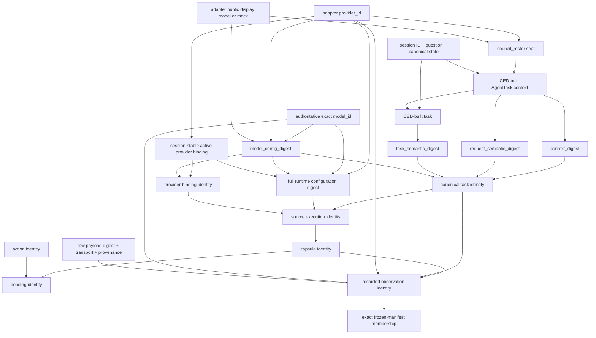

# SocratesZero Phase 8 v2 — Canonical Successor Parity PRE-RESULT Freeze

## Scientific status

**PRE-RESULT ONLY.** This document freezes the proposed Phase 8 v2 experiment
before its first authoritative aggregate. It is not an evaluation result and
does not claim that the hypothesis is supported.

| Item | Current state |
|---|---|
| Runtime environment | unchanged `ced-canonical-successor-env/v0` |
| Authoritative aggregate executions | `0` |
| Authoritative v2 result | **PENDING** |
| Authoritative v2 artifact ID / SHA-256 | **PENDING** |
| Reverse-order replay | **PENDING and forbidden before a SUPPORTED first artifact** |
| Replay-lock ID / SHA-256 | **PENDING** |
| Pre-result focused tests | `151 passed / 0 skipped / 0 failed / 0 warnings` |
| Live provider / model / tool calls in this pre-result documentation step | `0 / 0 / 0` |
| Production authority | `none` |

The sealed v1 artifact remains permanently `FALSIFIED`. The v2 experiment does
not repair, relabel, or rerun it. Phase 8.5, shadow collection, depth two,
Experience Store, learned Value, learned Policy, RL, and production authority
remain blocked.

The governing implementation sources are:

- `backend/dialogues/ced_canonical_successor_frozen_core_v2.py` — immutable
  implementation and predecessor locks;
- `backend/dialogues/ced_canonical_successor_cases_v2.py` — validation order,
  taxonomy, precedence, diagnostics, probes, case set, and composite corpus;
- `backend/dialogues/ced_canonical_successor_evaluation_v2.py` — additive
  harness, evidence, metrics, thresholds, artifact, replay, and write-once APIs.

The identifiers below were read from those import-only contracts without
invoking any aggregate, artifact builder, publisher, provider, model, tool, or
live path.

## Frozen deterministic identities

| Contract | Schema / value | Deterministic identity |
|---|---|---|
| Capture manifest | `ced-canonical-successor-capture-manifest/v0` | `cedcapturemanifest_ab3391e6fa324dec6ca2d8937ba09bdb7100c373fb7e7c38bb6be53bb0c86a60` |
| Core blob lock | `ced-canonical-successor-core-blob-lock/v2` | `cedcorebloblockv2_2cfc46afcf7afca20b4eb537d626296e11c8b85e885f5caa78d7322e0eb0a957` |
| Validation order | `ced-canonical-successor-validation-order/v1` | `cedvalidationorder_2bbd60972e07a9afdc3ca6f2dd344cd891f39dab6f9edb4e92c4ba0552203a54` |
| Failure taxonomy | `ced-canonical-transition-failure-taxonomy/v1` | `cedfailuretaxonomy_73bef28686e43b201cafb33fcc536d19a863bd0773592db8aa6867b5a1189cf7` |
| Failure precedence | `ced-canonical-transition-failure-precedence/v1` | `cedfailureprecedence_4d75632cc9dac55daf59a87142dbd918e6c6573e48afec32f2225db10eaf7d7f` |
| Compatibility diagnostics | `ced-canonical-successor-compatibility-diagnostics/v1` | `cedcompatdiagnostics_b577167b4199464b250328b58dbc248194076a3f1a9370f8cf28022d56ebd44f` |
| Probe design | `ced-canonical-successor-probe-design/v1` | `cedprobedesign_fd7d21658acea185d164ccb32c726b498c0f7a3aa476b4c1698c82a1847f9e2f` |
| Probe-design fingerprint | SHA-256 | `fd7d21658acea185d164ccb32c726b498c0f7a3aa476b4c1698c82a1847f9e2f` |
| v2 case set | `ced-canonical-successor-parity-case-set/v2` | `cedparitycasesetv2_3706cb242dd60070acec46d00def5389c62fb90f869d98d932649fe023dc1233` |
| Immutable predecessor corpus | `ced-canonical-successor-parity-corpus/v1` | `cedobscorpus_b5ebe4b46d2b3ae4fed3faded341c8a2d8ff5f5f254531f000e479bf66b7f8b7` |
| Predecessor corpus canonical SHA-256 | SHA-256 | `06c5eda5ee8c71992cb8b7427794f6d5ab6e44b4f92f0d6f71f4366d5729427c` |
| Composite v2 corpus | `ced-canonical-successor-parity-corpus/v2` | `cedparitycorpusv2_9d7d8563b931f1206c2e685c51d62dfa66b7a5ae66a40254fb63477f9c15524d` |
| Composite v2 corpus canonical SHA-256 | SHA-256 | `9d7d8563b931f1206c2e685c51d62dfa66b7a5ae66a40254fb63477f9c15524d` |
| Frozen thresholds | `ced-canonical-successor-parity-thresholds/v2` | `cedparitythresholdsv2_e241fe357d1a6c36e7e19addd0a421e0c55332bf16d999a2aa895fcdccf9e210` |

The remaining additive lineage names are exact:

```text
ced-canonical-successor-unavailable-probe/v2
ced-canonical-successor-probe-component-snapshot/v2
ced-canonical-successor-probe-construction-evidence/v2
ced-canonical-successor-compatibility-diagnostic-evidence/v1
ced-canonical-successor-unavailable-case-result/v2
ced-canonical-successor-probe-evaluation-failure/v2
ced-canonical-successor-parity-harness/v2
ced-canonical-successor-parity-metrics/v2
ced-canonical-successor-parity-artifact/v2
ced-canonical-successor-parity-replay-lock/v2
```

No artifact-instance or replay-lock-instance identity exists pre-result.

## Unchanged runtime lineages and authority

The experiment changes evaluator semantics only. These runtime lineages stay
byte- and meaning-identical:

```text
ced-canonical-successor-env/v0
ced-canonical-branch-capsule/v0
ced-pending-canonical-transition/v0
ced-canonical-task-semantic-identity/v0
ced-recorded-observation/v1
ced-canonical-transition-result/v0
ced-canonical-transition-receipt/v0
ced-canonical-successor-recording/v0
ced-opening-socratic-question/v0
ced-canonical-successor-semantic-parity/v0
```

CED remains the only canonical transition owner:
`backend.dialogues.ced.CEDOrchestrator`. The exact processor set remains:

```text
CEDOrchestrator._apply_registry_response
CEDOrchestrator._build_registry_phase_task
CEDOrchestrator._effective_registry_quorum
CEDOrchestrator._finalize_registry_phase
CEDOrchestrator._prepare_registry_phase
provider_registry.parse_and_validate_move
```

The evaluator may measure and compare. It may not create a second CED
classifier, reinterpret a runtime return, invoke a later validator after an
earlier failure, relax the manifest, or mutate production authority.

## Provider → roster → context dependency graph



The public roster and the private active provider binding are sibling
projections of registry/CED state; neither is derived from the other. Changing
a provider catalog ID changes the public roster seat, task context,
`context_digest`, `request_semantic_digest`, task/configuration lineage, and
therefore reaches A8 before A10. Changing only the authoritative exact model can
preserve the public display roster (`"mock"`) and reach A11. Changing only
`provider_timeout_seconds` preserves the earlier task/provider/model guards and
reaches A12. A private binding-only provider mismatch is contract-test
reachable, but not an honest ordinary-lifecycle orthogonal aggregate probe.

## Exact 44-guard canonical order

The order contract has ID
`cedvalidationorder_2bbd60972e07a9afdc3ca6f2dd344cd891f39dab6f9edb4e92c4ba0552203a54`.
For a failure-producing guard, every later guard in this table is short-circuited
unless the applied pipeline explicitly continues to construct an owned
canonical outcome. `A15a` and `A15b` are separate guards, which is why the
sequence contains exactly 44 rows.

| # | Guard | Stage | Check | Owner / inputs | Canonical result | Independently probeable? |
|---:|---|---|---|---|---|:---:|
| 1 | `C1` | `CAPTURE` | source state is the exact registered CED session object | successor environment; `ced._sessions`, `state_object_identity` | `INVALID_ROOT` | yes |
| 2 | `C2` | `CAPTURE` | existing usage fits the capture budget | budget contract; `budget`, `usage` | `BUDGET_EXHAUSTED` | yes |
| 3 | `C3` | `CAPTURE` | registry exists and retry or unsupported mutable facilities are disabled | successor environment; `ced_runtime_configuration` | `INVALID_ROOT` | no |
| 4 | `C4` | `CAPTURE` | provider catalog is nonempty, offline or fake, unique, available, and exact-model identified | registry and successor environment; `adapters`, `provider_catalog` | `INVALID_ROOT` | no |
| 5 | `C5` | `CAPTURE` | session adapter order and bindings cover canonical agents exactly | CED and successor environment; `adapter_orders`, `private_bindings`, `agents` | `INVALID_ROOT` | no |
| 6 | `C6` | `CAPTURE` | snapshot, configuration, and session rehydrate exactly | successor environment; `snapshot`, `configuration_digest`, `session_id` | `INVALID_ROOT` | no |
| 7 | `C7` | `CAPTURE` | root is pristine round-zero opening with pristine agents, empty ledgers and failures, and one task | CED and successor environment; `state`, `side_ledgers`, `registry` | `INVALID_ROOT` | no |
| 8 | `C8` | `CAPTURE` | canonical task, context, request, and model-configuration identity derive | CED task contract; `state`, `task_specification`, `active_binding` | `INTERNAL_CONTRACT_ERROR` | no |
| 9 | `C9` | `CAPTURE` | root projects to the sole hard-legal opening Socratic action | CED constitution; `projected_root` | `INVALID_ROOT` | no |
| 10 | `C10` | `CAPTURE` | new capsule snapshot, bindings, budget, lineage, and IDs are self-consistent | capsule contract; `full_capsule` | `CONTRACT_VALIDATION_ERROR_PROPAGATES` | no |
| 11 | `C11` | `CAPTURE` | capture leaves source CED unchanged | successor environment; `before_fingerprint`, `after_fingerprint` | `INVALID_ROOT` | no |
| 12 | `P1` | `PREPARE` | capsule schema and identity round-trip | capsule contract; `source_capsule` | `INVALID_ROOT` | no |
| 13 | `P2` | `PREPARE` | root-only lineage, rehydration, pristine state, and active binding replay | CED and successor environment; `source_capsule`, `rehydrated_root`, `active_binding` | `INVALID_ROOT` | no |
| 14 | `P3` | `PREPARE` | rebuilt task equals the frozen canonical task | CED and successor environment; `root`, `frozen_task`, `binding_configuration` | `INVALID_ROOT` | no |
| 15 | `P4` | `PREPARE` | semantic root, SearchState-v1, and side-ledger identities replay | projection and successor environment; `source_capsule`, `rehydrated_root`, `side_ledgers` | `INVALID_ROOT` | no |
| 16 | `P5` | `PREPARE` | supplied budget equals the frozen root budget | successor environment; `supplied_budget`, `source_capsule.budget` | `INVALID_ROOT` | no |
| 17 | `P6` | `PREPARE` | action schema and identity round-trip | action contract; `action` | `ILLEGAL_ACTION` | no |
| 18 | `P7` | `PREPARE` | action family is supported by the canonical successor | successor environment; `action.action_family` | `UNSUPPORTED_ACTION_FAMILY` | yes |
| 19 | `P8` | `PREPARE` | complete hard-legal set contains the selected action | CED constitution; `root`, `complete_hard_legal_set`, `selected_action` | `ILLEGAL_ACTION` | yes |
| 20 | `P9` | `PREPARE` | one successor reservation fits the budget | budget contract; `before_usage`, `reserved_usage`, `budget` | `BUDGET_EXHAUSTED` | yes |
| 21 | `P10` | `PREPARE` | pending links root, action, task, provider, model, budget, legal set, and derived IDs | pending transition contract; `full_pending_transition` | `INVALID_ROOT` | no |
| 22 | `A1` | `APPLY` | pending has no stored extras and round-trips | pending contract and successor environment; `pending_transition` | `INVALID_ROOT` | no |
| 23 | `A2` | `APPLY` | pending re-prepares identically from its embedded root | successor environment and CED; `pending.source_capsule`, `pending.action`, `pending.budget` | `INVALID_ROOT_OR_EARLIER_PREPARE_REASON` | no |
| 24 | `A3` | `APPLY` | recorded observation exists | successor environment; `caller_observation` | `MISSING_OBSERVATION` | yes |
| 25 | `A4` | `APPLY` | stored or mapping extras and future fields are absent | successor environment; `observation_object_structure` | `FUTURE_LABEL_FORBIDDEN_OR_INVALID_OBSERVATION_IDENTITY` | yes |
| 26 | `A5` | `APPLY` | observation schema, transport shape, raw digest, model-configuration relation, and identity validate | observation contract; `observation_fields`, `raw_bytes` | `INVALID_OBSERVATION_OR_INVALID_OBSERVATION_IDENTITY` | yes |
| 27 | `A6` | `APPLY` | structured raw JSON contains no future or control fields | successor environment; `delivered_raw_json` | `FUTURE_LABEL_FORBIDDEN` | no |
| 28 | `A7` | `APPLY` | observation is an exact frozen manifest member | capture-manifest authority; `entire_observation`, `frozen_manifest` | `INVALID_OBSERVATION_IDENTITY` | no |
| 29 | `A8` | `APPLY` | source-session, context, and request compatibility hold | compatibility contract; `source_session_semantic_id`, `context_digest`, `request_semantic_digest` | `ROOT_CONTEXT_MISMATCH` | yes |
| 30 | `A9` | `APPLY` | phase, round, slot, attempt, agent, role, kind, task digest, and action compatibility hold | compatibility contract; `task_coordinates`, `agent_id`, `role`, `task_kind`, `task_semantic_digest`, `action_id` | `OBSERVATION_TASK_MISMATCH` | yes |
| 31 | `A10` | `APPLY` | private provider binding compatibility holds | compatibility contract; `observed_provider_id`, `expected_provider_id` | `OBSERVATION_PROVIDER_MISMATCH` | no |
| 32 | `A11` | `APPLY` | configured and actual model binding compatibility holds | compatibility contract; `configured_model_id`, `actual_model_id` | `OBSERVATION_MODEL_MISMATCH` | yes |
| 33 | `A12` | `APPLY` | source and task or model configuration compatibility holds | compatibility contract; `source_configuration_digest`, `model_config_digest` | `OBSERVATION_CONFIG_MISMATCH` | yes |
| 34 | `A13` | `APPLY` | residual capsule and source-execution lineage compatibility holds | compatibility contract; `source_capsule_id`, `source_execution_id` | `ROOT_CONTEXT_MISMATCH` | no |
| 35 | `A14` | `APPLY` | special `REFUSED` transport projection is rejected | successor environment; `observation.transport_status` | `CANONICAL_PROCESSING_REJECTED` | no |
| 36 | `A15a` | `APPLY` | source capsule rehydrates outside the broad processing catch | successor environment and CED rehydration; `pending.source_capsule` | `REHYDRATION_CONTRACT_ERROR_PROPAGATES` | no |
| 37 | `A15b` | `APPLY` | CED phase prelude, one specification, and rebuilt-task equality complete inside the processing catch | successor environment and CED; `rehydrated_root`, `phase_prelude`, `rebuilt_task` | `CANONICAL_PROCESSING_REJECTED` | no |
| 38 | `A16` | `APPLY` | JSON parse or repair and move, schema, and marker validation produce canonical provider status | canonical parser; `raw_text`, `canonical_task` | `PARSER_OR_SCHEMA_PROVIDER_STATUS` | no |
| 39 | `A17` | `APPLY` | Socratic content contract and injection firewall evaluate the parsed move | CED; `parsed_move`, `rehydrated_state` | `CONTENT_OR_INJECTION_CANONICAL_REJECTION` | no |
| 40 | `A18` | `APPLY` | move, task-log, and dispatch application or rejection classification completes | CED; `provider_response`, `canonical_task`, `rehydrated_state` | `APPLIED_ACCEPTED_OR_CANONICAL_REJECTION` | no |
| 41 | `A19` | `APPLY` | phase finalization, quorum, and registry-round append complete | CED; `response`, `dispatch_record`, `rehydrated_state` | `CANONICAL_PROCESSING_REJECTED_ON_EXCEPTION` | no |
| 42 | `A20` | `APPLY` | CED outcome projects to canonical successor outcome | successor environment; `ced_application_record` | `APPLIED_ACCEPTED_OR_APPLIED_CANONICAL_REJECTION` | no |
| 43 | `A21` | `APPLY` | successor configuration remains unchanged | successor environment; `before_configuration_digest`, `after_configuration_digest` | `CANONICAL_PROCESSING_REJECTED` | no |
| 44 | `A22` | `APPLY` | successor, receipt, and result identities and lineage validate | frozen contracts; `applied_state`, `canonical_outcome`, `receipt`, `result` | `CONTRACT_VALIDATION_ERROR` | no |

The literal compatibility order is:

```text
A8 root context → A9 task/action → A10 provider → A11 model
→ A12 configuration → A13 residual lineage
```

## Failure taxonomy and precedence law

The taxonomy contains exactly 16 codes in four disjoint layers.

| Code | Layer | Governing guards | Independent aggregate reachability |
|---|---|---|:---:|
| `INVALID_ROOT` | preparation | C1, C3–C7, C9, C11, P1–P5, P10, A1, A2 | yes |
| `ILLEGAL_ACTION` | preparation | P6, P8 | yes |
| `UNSUPPORTED_ACTION_FAMILY` | preparation | P7 | yes |
| `BUDGET_EXHAUSTED` | preparation | C2, P9 | yes |
| `MISSING_OBSERVATION` | observation binding | A3 | yes |
| `INVALID_OBSERVATION` | observation binding | A5 | yes |
| `INVALID_OBSERVATION_IDENTITY` | observation binding | A4, A5, A7 | yes |
| `FUTURE_LABEL_FORBIDDEN` | observation binding | A4, A6 | yes |
| `ROOT_CONTEXT_MISMATCH` | observation binding | A8, A13 | yes |
| `OBSERVATION_TASK_MISMATCH` | observation binding | A9 | yes |
| `OBSERVATION_PROVIDER_MISMATCH` | observation binding | A10 | no; private-binding/contract reachability only |
| `OBSERVATION_MODEL_MISMATCH` | observation binding | A11 | yes |
| `OBSERVATION_CONFIG_MISMATCH` | observation binding | A12 | yes |
| `CANONICAL_PROCESSING_REJECTED` | canonical processing | A14, A15b, A19, A21 | no standalone v2 negative |
| `APPLIED_CANONICAL_REJECTION` | applied | A16–A18, A20 | represented by four v1 references |
| `APPLIED_ACCEPTED` | applied | A18, A20 | represented by one v1 reference |

The selected and frozen precedence model is exactly:

```text
FIRST_CANONICAL_GUARD_WINS
PRIMARY FAILURE = FIRST FAILED CANONICAL GUARD IN ACTUAL SOURCE ORDER
```

The runtime return/raise owns the primary result. Later or dominated mismatch
fields are optional, evaluator-side advisory evidence only. They are computed
from immutable snapshots/manifests, cannot override the primary result, cannot
authorize parsing or application, and cannot invoke later guards. Expected and
observed guard IDs, primary field sets, advisory field sets, full guard traces,
and unreachable guards remain separate so a mismatch is representable rather
than self-certified.

## Probe invariant-vector notation

Every probe freezes exactly these 15 relations:

```text
root  capsule  pending  task  context  roster  action  manifest
payload  provider  model  config  lineage  future  budget
```

In the tables below, `I={...}` means `INTENTIONALLY_CHANGED`, `D={...}` means
`DEPENDENTLY_CHANGED`, and `N={...}` means `NOT_APPLICABLE`. Every field not
listed in those three sets is exactly `PRESERVED`. This representation is a
lossless rendering of the full 15-field `ProbeInvariantVector`.

All 18 probes freeze `canonical_parser_reached=False` and
`ced_application_reached=False`. `scan=yes` means only the pre-A16 structural
future-field scan may use `json.loads`; it never calls the canonical parser or
CED application. For each probe, all guards before the target are frozen as
`EVALUATED_PASSED`, the target as `EVALUATED_FAILED`, and later guards as
`NOT_EVALUATED` or `NOT_CONSTRUCTED` according to stage.

### Eleven ORTHOGONAL probes

Each row changes exactly one independent authoritative input; every other
change is a declared dependency.

| Probe | Exact literal mutation | I / D / N invariant sets | Submission; scan | First guard → primary | Primary fields; advisory fields |
|---|---|---|---|---|---|
| `p8v2-o01-invalid-root-registration` | `root.object_registration`: `"registered_canonical_object"` → `"detached_deep_copy"` | I={root}; D={}; N={capsule,pending,lineage} | N/A; no | C1 → `INVALID_ROOT` | primary={}; advisory={} |
| `p8v2-o02-illegal-action-capability` | `action.required_capabilities`: `[]` → `["not-present-in-root"]` | I={action}; D={}; N={pending} | N/A; no | P8 → `ILLEGAL_ACTION` | primary={required_capabilities}; advisory={} |
| `p8v2-o03-missing-observation` | `observation`: exact manifest observation → `null` | I={manifest}; D={}; N={payload} | `NOT_SUBMITTED`; no | A3 → `MISSING_OBSERVATION` | primary={}; advisory={} |
| `p8v2-o04-invalid-observation-schema` | `observation`: exact manifest observation → `{"schema_version":"ced-recorded-observation/v1"}` | I={payload}; D={}; N={manifest} | `SUBMITTED`; no | A5 → `INVALID_OBSERVATION` | primary={}; advisory={} |
| `p8v2-o05-tampered-raw-digest` | `observation.raw_output_digest`: `912c229dca5ecb8d0ad0736b5e5241dae6e5a3a6ddf9151e323d1bc321d24f62` → `ffffffffffffffffffffffffffffffffffffffffffffffffffffffffffffffff`, raw bytes held exact | I={manifest}; D={}; N={} | `SUBMITTED`; no | A5 → `INVALID_OBSERVATION_IDENTITY` | primary={raw_output_digest}; advisory={} |
| `p8v2-o06-wrong-task-agent` | `root.active_agent_id`: `phase8-recorded-agent-1` → `phase8-recorded-agent-1-v2`; provider seat held | I={task}; D={root,capsule,pending,config,lineage}; N={} | `SUBMITTED`; yes | A9 → `OBSERVATION_TASK_MISMATCH` | primary={agent_id,task_semantic_digest}; advisory={source_capsule_id,source_configuration_digest,source_execution_id} |
| `p8v2-o07-wrong-root-question` | `root.question`: `Is knowledge merely justified true belief?` → `What is knowledge?` | I={root}; D={capsule,pending,task,lineage}; N={} | `SUBMITTED`; yes | A8 → `ROOT_CONTEXT_MISMATCH` | primary={request_semantic_digest,source_session_semantic_id}; advisory={source_capsule_id,source_execution_id,task_semantic_digest} |
| `p8v2-o08-wrong-exact-model` | `root.active_model_id`: `phase8-recorded-model/1` → `phase8-recorded-model/1-v2-orthogonal`; display roster and narrow provider held | I={model}; D={root,capsule,pending,task,config,lineage}; N={} | `SUBMITTED`; yes | A11 → `OBSERVATION_MODEL_MISMATCH` | primary={actual_model_id,configured_model_id}; advisory={model_config_digest,source_capsule_id,source_configuration_digest,source_execution_id,task_model_config_digest} |
| `p8v2-o09-wrong-runtime-timeout` | `runtime.provider_timeout_seconds`: `30.0` → `31.0` | I={config}; D={root,capsule,pending,lineage}; N={} | `SUBMITTED`; yes | A12 → `OBSERVATION_CONFIG_MISMATCH` | primary={source_configuration_digest}; advisory={source_capsule_id,source_execution_id} |
| `p8v2-o10-future-label` | add top-level `observation.reward`: absent/`null` → `1` | I={future}; D={}; N={} | `SUBMITTED`; no | A4 → `FUTURE_LABEL_FORBIDDEN` | primary={reward}; advisory={} |
| `p8v2-o11-budget-exhausted` | `budget.max_nodes`: `4` → `1`; `max_expansions=3` and all other inputs held | I={budget}; D={root,capsule,lineage}; N={pending} | N/A; no | P9 → `BUDGET_EXHAUSTED` | primary={max_nodes}; advisory={} |

### Seven PRECEDENCE probes

Each row predeclares multiple independent changes or one dependency chain that
necessarily reaches more than one relation; the earliest canonical guard owns
the primary result.

| Probe | Exact literal mutation(s) | I / D / N invariant sets | Submission; scan | First guard → primary | Primary fields; advisory fields |
|---|---|---|---|---|---|
| `p8v2-p01-unsupported-family-vs-legality` | `action.action_family`: `OPENING` → `RUN_ELENCHUS` | I={action}; D={}; N={pending} | N/A; no | P7 → `UNSUPPORTED_ACTION_FAMILY` | primary={action_family}; advisory={not_in_legal_set} |
| `p8v2-p02-provider-roster-context` | provider catalog seats `phase8-recorded-seat-0/1` → `phase8-wrong-seat-0/1` | I={roster}; D={root,capsule,pending,task,context,provider,config,lineage}; N={} | `SUBMITTED`; yes | A8 → `ROOT_CONTEXT_MISMATCH` | primary={context_digest,request_semantic_digest}; advisory={model_config_digest,provider_id,source_capsule_id,source_configuration_digest,source_execution_id,task_model_config_digest,task_semantic_digest} |
| `p8v2-p03-root-plus-provider` | question → `What is knowledge?` and both provider seats → `phase8-wrong-seat-0/1` | I={root,roster}; D={capsule,pending,task,context,provider,config,lineage}; N={} | `SUBMITTED`; yes | A8 → `ROOT_CONTEXT_MISMATCH` | primary={context_digest,request_semantic_digest,source_session_semantic_id}; advisory={model_config_digest,provider_id,source_capsule_id,source_configuration_digest,source_execution_id,task_model_config_digest,task_semantic_digest} |
| `p8v2-p04-task-plus-model` | active agent → `phase8-recorded-agent-1-v2`; exact model → `phase8-recorded-model/1-v2-orthogonal` | I={task,model}; D={root,capsule,pending,config,lineage}; N={} | `SUBMITTED`; yes | A9 → `OBSERVATION_TASK_MISMATCH` | primary={agent_id,task_semantic_digest}; advisory={actual_model_id,configured_model_id,model_config_digest,source_capsule_id,source_configuration_digest,source_execution_id,task_model_config_digest} |
| `p8v2-p05-context-plus-tampered-digest` | question → `What is knowledge?`; stored raw digest → 64 `f` characters with raw bytes held | I={root,manifest}; D={capsule,pending,task,lineage}; N={} | `SUBMITTED`; no | A5 → `INVALID_OBSERVATION_IDENTITY` | primary={raw_output_digest}; advisory={request_semantic_digest,source_capsule_id,source_execution_id,source_session_semantic_id,task_semantic_digest} |
| `p8v2-p06-illegal-plus-incompatible-observation` | question → `What is knowledge?`; required capabilities `[]` → `["not-present-in-root"]`; accepted observation held but not submitted | I={root,action}; D={capsule,task,lineage}; N={pending} | `NOT_SUBMITTED`; no | P8 → `ILLEGAL_ACTION` | primary={required_capabilities}; advisory={action_id,request_semantic_digest,source_capsule_id,source_execution_id,source_session_semantic_id,task_semantic_digest} |
| `p8v2-p07-caller-rebinding-vs-manifest` | `caller.binding_case`: `opening-scripted-mock` → `opening-empty-question`; scripted raw bytes re-minted against the other binding | I={root,capsule,pending,task,manifest,provider,model,lineage}; D={config}; N={} | `SUBMITTED`; yes | A7 → `INVALID_OBSERVATION_IDENTITY` | primary={manifest_exact_observation}; advisory={actual_model_id,agent_id,configured_model_id,model_config_digest,provider_id,request_semantic_digest,source_capsule_id,source_execution_id,source_session_semantic_id,task_model_config_digest,task_semantic_digest} |

For P8, observation compatibility advisories are enumerated only when the
observation is intentionally held but `NOT_SUBMITTED` (`p06`). They are not
invented for `o02`, whose observation state is `NOT_APPLICABLE`.

### Exact probe fingerprints

| Human probe ID | Frozen fingerprint |
|---|---|
| `p8v2-o01-invalid-root-registration` | `29155a104236c5d5f3d11ff5d404d70cddab37efe1e2b677263a7299b37537fe` |
| `p8v2-o02-illegal-action-capability` | `7cb275980a51adfb09bb48c6a7fa4766320e5bbd03e48bc17a2b69464a4bad1b` |
| `p8v2-o03-missing-observation` | `22e9cc7c34f693f96871a03dd48f5f789bf09c26f9f367a2aa92395d77c3bec5` |
| `p8v2-o04-invalid-observation-schema` | `54711ac1efec9408d696e122ef79c1310aaf30b5b002494a80e123e4d1d8964f` |
| `p8v2-o05-tampered-raw-digest` | `93500fa5d1f8d76a6fb824590bf0dd557b6c54ace6d12e33fc0b34894b97e5f4` |
| `p8v2-o06-wrong-task-agent` | `dafc8c0cae120f7f8353ef566e2c9060fd348d7f5b9a9bbcd967e9b1df940e20` |
| `p8v2-o07-wrong-root-question` | `644fbb6c3be82720215fdfcd9d36141d8368fd5e0db30705d2c612a588a28e27` |
| `p8v2-o08-wrong-exact-model` | `d3af214134abef2320af1fa696c0386734cd6c9f252144585f04de438b683a14` |
| `p8v2-o09-wrong-runtime-timeout` | `aac76d506841fc44f35f86db37ec45ba11580cb15be0c5ab4b78f85448fd8329` |
| `p8v2-o10-future-label` | `93b3ea24355502e2596e0b182f272f0f028019e4f77dac88f001ae94020eef40` |
| `p8v2-o11-budget-exhausted` | `ceb7d64e3ca54797c2de737dba457066a15004b388481db32612cfb02e584a0d` |
| `p8v2-p01-unsupported-family-vs-legality` | `42464f2e5227bdbafc617f45168bdbf681952ff017443bec9ac6912c1ee68374` |
| `p8v2-p02-provider-roster-context` | `4392d052bf43a69593185af7482bc59d9fc45083c4b954e930cae1348d16f3e3` |
| `p8v2-p03-root-plus-provider` | `694b55219d1576f480c056deb5ec534a174d790c8a48ca510b19b60691d68fe7` |
| `p8v2-p04-task-plus-model` | `1c3ab60b4407bdb551f257f8b01e49bd506abb4a6342f04153b7cb00e7487811` |
| `p8v2-p05-context-plus-tampered-digest` | `0029393aa355cc3b25684058c9dcaa736cca2d5b9cbdd106be212008e7342b53` |
| `p8v2-p06-illegal-plus-incompatible-observation` | `457382922082d3d9c26a3fb116870bdaa1d297a394c75d2b4c9214c6233798b5` |
| `p8v2-p07-caller-rebinding-vs-manifest` | `d5c2e08b898cde4ab040d91e4b837b5454789b24615b74265a4bbea48270e71f` |

## Five immutable v1 references and the 23-case corpus

The v2 corpus references these records; it does not copy, re-record, or
regenerate any observation or expected successor.

| Case | v1 case ID | v1 reference ID | Role |
|---|---|---|---|
| `opening-empty-question` | `cedobscasev1_10d9781cb3a252ecd759449885081e8a6670996e5fdf7435f5242872c5218905` | `cedsuccessorref_85abdbfec328b39cc43630a8cea70ca2696843cfed9e4e6d5ff9b13599072ef2` | canonical rejection |
| `opening-injection-question` | `cedobscasev1_bcd6517311b1a76644b3e533bfb5ca576e7afb84d3a3e05505f59db7c28c2ac6` | `cedsuccessorref_33244c4894345a37f56088c6149f8262fbf2e146ccc3b3231ec1aa2535e43e61` | canonical rejection |
| `opening-invalid-json` | `cedobscasev1_e5ad44bc15348ea9f82d406afc785c9a70dab9b98582644c585c0216641b901c` | `cedsuccessorref_128626044b00732b181d9658ecd5b4ea8b3a4e0855fc32c214109495e4b91f8f` | canonical rejection |
| `opening-schema-error` | `cedobscasev1_eba36c3c48cb05f8f7b63b66945ca91a5853da3feeb1bc35d44a0fefda4f0cf3` | `cedsuccessorref_aa10387f33f114023cc263c2a8ba7cd721c9d46ebe860a63a61a1299de71e3d2` | canonical rejection |
| `opening-scripted-mock` | `cedobscasev1_7a7cefff8d5cb30ff35e70342016304a7c98835e7c575e2a39b07a4afdc4144a` | `cedsuccessorref_6efccf0d4a43b1c96845eb71d57fd6fb5f6e5d6b43154e3f49cdaad6832dcc44` | accepted |

The exact composite membership is:

```text
5 immutable supported references
+ 11 ORTHOGONAL negative probes
+ 7 PRECEDENCE negative probes
= 23 total cases
```

The five supported cases retain their strict v1 semantic, SearchState-v1,
accepted move-ID, rejection-kind, task-log, commitment, phase/role, processor,
observation-identity, receipt, resource, Value-v1 compatibility, idempotence,
source/sibling/production isolation, and offline-fixture accounting checks.

## Harness and evidence contracts

The harness ID is `ced-canonical-successor-parity-harness/v2`. It reuses the v1
positive-case evaluator only for the five immutable references. It does not call
the v1 aggregate or v1 negative builders.

### Negative-probe validity gate

Before invoking any probe operation, the evaluator must construct:

1. independent reference and candidate component snapshots;
2. the measured 15-field invariant vector derived from snapshot equality;
3. the actual observed literal-mutation tuple;
4. the independently observed execution stage;
5. the exact observation-submission state; and
6. ground-truth-firewall evidence.

Invocation is forbidden unless all six agree with the frozen probe contract.
An invalid vector, literal tuple, submission state, or firewall produces a
`CanonicalSuccessorProbeEvaluationFailureV2`; it is not scored as a transition
classification and it falsifies the aggregate.

### Ground-truth firewall

Runtime operation closures contain only operational inputs. Expected reason,
guard, vector, probe class/stage, outcome/status/failure metadata, and v1
reference truth are forbidden in parameters, defaults, keyword defaults,
captured nonlocals, referenced globals, and reachable serialized object state.
The traversal is cycle-safe across mappings, collections, Pydantic models,
dataclasses, custom/function attributes and slots, nested callable closures,
and otherwise-inspectable nested structures. Uninspectable nonprimitive
carriers fail closed. Forbidden
evaluator-truth enums, guard/reason strings, serialized expected structures,
`expected_*` names, and equivalent values are rejected before invocation; only
the legitimate runtime binding names `expected_provider_id` and
`expected_model_id` are narrowly allowlisted. The construction switch accepts
only the human `probe_id`; each returned zero-argument operation contains no
expected result or vector metadata.

### Representable evidence, including falsification

`ced-canonical-successor-unavailable-case-result/v2` can represent:

- raised unavailability;
- returned `SUCCESSOR_UNAVAILABLE`;
- an unexpected returned successor;
- an unexpected non-result;
- optional actual reason/status/guard;
- actual result, transition, receipt, successor capsule/branch/SearchState IDs;
- an independent identical replay of the probe operation;
- source, unselected sibling, and production-control fingerprints and dispatch
  counters before and after;
- exact receipt/resource/idempotence/isolation evidence; and
- separate negative dispatch, aggregate provider dispatch, live, primary/replay
  model, total model, and tool-call counters.

Therefore a wrong successful successor remains first-class falsification
evidence; it is not converted into an opaque evaluator exception. Supported
root/materialize/apply/evidence exceptions are preserved as deterministic
`ced-canonical-successor-probe-evaluation-failure/v2` rows with failure codes
`CONSTRUCTION_FAILED`, `INVALID_PROBE_CONSTRUCTION`,
`GROUND_TRUTH_FIREWALL_FAILED`, `INVOCATION_FAILED`, or
`EVIDENCE_EXTRACTION_FAILED`.

Diagnostic evidence keeps independently derived field comparisons and actual
guard/field/trace data separate from frozen expectations. Its
`authoritative_for_primary_result` value is always `false`.

## Metrics and exact thresholds

The metrics schema reports these exact fields:

```text
cases_total
supported_authoritative_cases
accepted_reference_cases
canonical_rejection_reference_cases
orthogonal_negative_cases
precedence_negative_cases
accepted_parity
canonical_rejection_parity
orthogonal_primary_classifications
precedence_primary_classifications
evaluation_failures
validity_gate_failures
invariant_vector_mismatches
literal_mutation_mismatches
ground_truth_firewall_failures
primary_classification_mismatches
guard_precedence_mismatches
diagnostic_mismatches
status_mismatches
canonical_rejection_reason_mismatches
semantic_mismatches
accepted_move_id_mismatches
task_log_mismatches
commitment_mismatches
phase_role_mismatches
search_state_v1_mismatches
canonical_processor_mismatches
observation_identity_mismatches
source_isolation_failures
sibling_isolation_failures
production_mutations
receipt_mismatches
resource_accounting_mismatches
value_v1_compatibility_mismatches
idempotence_failures
negative_successors_created
fabricated_observations
future_label_violations
historical_offline_fixture_dispatches
negative_probe_dispatches
aggregate_provider_dispatches
live_calls
model_calls
tool_calls
core_lock_mismatches
predecessor_lock_mismatches
```

The frozen threshold object requires exactly:

| Threshold | Required value |
|---|---:|
| total / supported / accepted / canonical-rejection cases | `23 / 5 / 1 / 4` |
| orthogonal / precedence cases | `11 / 7` |
| accepted parity | `1` exactly |
| canonical-rejection parity | `4` exactly |
| total supported parity | `5` exactly |
| orthogonal primary classifications | `11` exactly |
| precedence primary classifications | `7` exactly |
| historical offline fixture dispatches | `5` exactly; historical evidence, not new calls |
| every mismatch/failure/security/isolation/lock counter listed above | `0` |
| negative probe dispatches | `0` |
| aggregate provider dispatches | `0` |
| live provider calls | `0` |
| model calls | `0` |
| tool calls | `0` |
| depth / recursive successor | `1 / false` |

The accepted and rejection requirements are individually strict; a synthetic
`2 + 3 = 5` split cannot pass. `SUPPORTED` is derivable only if every exact
threshold holds. Any other valid artifact is `FALSIFIED`.

`fabricated_observations` and `future_label_violations` are narrow security
counters: unrelated diagnostic or isolation failures do not relabel themselves
as fabrication or future-label leakage. Their own counters still falsify.

## Artifact, replay, and write-once chronology

The first authoritative artifact schema is
`ced-canonical-successor-parity-artifact/v2`. It must embed or link all of:

- unchanged environment/capsule/pending/task/observation/result/receipt,
  recording, manifest, action-family, and parity lineage IDs;
- the capture-manifest ID and canonical processor IDs;
- the full frozen core lock and its ID;
- the sealed predecessor ID, SHA-256, commit, status `FALSIFIED`, and change
  rationale `failure-precedence-and-probe-orthogonality`;
- validation-order, taxonomy, precedence, diagnostics, probe-design, case-set,
  corpus, corpus-SHA, thresholds, and threshold IDs;
- exactly five positive, eleven orthogonal, and seven precedence evidence rows;
- metrics derived again from those rows;
- `depth=1`, `recursive_successor=false`, `production_authority=none`; and
- a status mechanically derived as `SUPPORTED` or `FALSIFIED`.

Its exact top-level field inventory is:

```text
schema_version, artifact_id, harness_id, environment_id, branch_capsule_id,
pending_transition_id, task_semantic_identity_id, recorded_observation_id,
transition_result_id, transition_receipt_id, recording_contract_id,
capture_manifest_schema_id, capture_manifest_id, supported_action_family,
parity_definition_id, canonical_transition_owner, canonical_processor_ids,
core_lock, core_lock_id, predecessor_artifact_id,
predecessor_artifact_sha256, predecessor_artifact_commit, predecessor_status,
change_rationale, validation_order_id, failure_taxonomy_id,
failure_precedence_id, compatibility_diagnostics_id, probe_design_id,
case_set_id, case_set, corpus_id, corpus_canonical_sha256, thresholds_id,
thresholds, parity_cases, orthogonal_cases, precedence_cases, metrics, depth,
recursive_successor, production_authority, hypothesis_status
```

The artifact validator sorts evidence canonically, recomputes metrics, checks
all lineage links, and derives `cedparityartifactv2_*` from the entire payload.
The first artifact must be published once whether `SUPPORTED` or `FALSIFIED`.
There is no aggregate retry, result tuning, post-result expectation edit, or
artifact replacement.

The required chronology is:

1. finish pre-result review and focused/regression gates;
2. commit the complete semantic freeze;
3. run exactly one authoritative 23-case aggregate in canonical order;
4. publish the first artifact with write-once semantics regardless of status;
5. if and only if it is `SUPPORTED`, run one fresh reverse-order aggregate;
6. validate both actual artifacts internally;
7. require semantic equality, artifact-ID equality, canonical byte identity,
   and equal SHA-256; and
8. only then construct and publish
   `ced-canonical-successor-parity-replay-lock/v2` once.

The replay reverses all three order groups independently: five supported cases,
eleven orthogonal probes, and seven precedence probes. The replay-lock API
accepts two actual validated `SUPPORTED` artifacts; it accepts no caller-created
lock or caller-supplied equality claims.

The replay-lock field inventory is exactly:

```text
schema_version, replay_lock_id, authoritative_artifact_id, replay_artifact_id,
authoritative_sha256, replay_sha256, authoritative_supported_order,
authoritative_orthogonal_order, authoritative_precedence_order,
replay_supported_order, replay_orthogonal_order, replay_precedence_order,
semantic_equality=true, artifact_id_equality=true, byte_identity=true
```

The six locked execution-order tuples are exactly:

```text
authoritative supported:
  opening-empty-question
  opening-injection-question
  opening-invalid-json
  opening-schema-error
  opening-scripted-mock

authoritative orthogonal:
  p8v2-o01-invalid-root-registration
  p8v2-o02-illegal-action-capability
  p8v2-o03-missing-observation
  p8v2-o04-invalid-observation-schema
  p8v2-o05-tampered-raw-digest
  p8v2-o06-wrong-task-agent
  p8v2-o07-wrong-root-question
  p8v2-o08-wrong-exact-model
  p8v2-o09-wrong-runtime-timeout
  p8v2-o10-future-label
  p8v2-o11-budget-exhausted

authoritative precedence:
  p8v2-p01-unsupported-family-vs-legality
  p8v2-p02-provider-roster-context
  p8v2-p03-root-plus-provider
  p8v2-p04-task-plus-model
  p8v2-p05-context-plus-tampered-digest
  p8v2-p06-illegal-plus-incompatible-observation
  p8v2-p07-caller-rebinding-vs-manifest

replay supported:
  opening-scripted-mock
  opening-schema-error
  opening-invalid-json
  opening-injection-question
  opening-empty-question

replay orthogonal:
  p8v2-o11-budget-exhausted
  p8v2-o10-future-label
  p8v2-o09-wrong-runtime-timeout
  p8v2-o08-wrong-exact-model
  p8v2-o07-wrong-root-question
  p8v2-o06-wrong-task-agent
  p8v2-o05-tampered-raw-digest
  p8v2-o04-invalid-observation-schema
  p8v2-o03-missing-observation
  p8v2-o02-illegal-action-capability
  p8v2-o01-invalid-root-registration

replay precedence:
  p8v2-p07-caller-rebinding-vs-manifest
  p8v2-p06-illegal-plus-incompatible-observation
  p8v2-p05-context-plus-tampered-digest
  p8v2-p04-task-plus-model
  p8v2-p03-root-plus-provider
  p8v2-p02-provider-roster-context
  p8v2-p01-unsupported-family-vs-legality
```

The replay-lock validator binds those tuples to the frozen constants as well as
checking the exact reversal relation; arbitrary caller-chosen memberships or
orders cannot self-certify. Both artifact IDs must also be nonblank before
identity equality can be considered.

Write-once publication creates the destination exclusively. If a destination
already exists, byte-identical content is accepted idempotently and conflicting
bytes are rejected. A `FALSIFIED` first artifact remains immutable and forbids
the reverse aggregate and replay lock.

At this PRE-RESULT checkpoint, every item in steps 3–8 above is **PENDING**.

## Frozen core and predecessor locks

The core-lock fingerprint and lock-ID suffix are both
`2cfc46afcf7afca20b4eb537d626296e11c8b85e885f5caa78d7322e0eb0a957`.
The lock contains exactly 34 Git blobs:

| Repository path | Frozen Git blob |
|---|---|
| `backend/dialogues/agent.py` | `65254fe5d9d2df2a8fc539020b0868078b3631fc` |
| `backend/dialogues/ced.py` | `9a1c7ab4610c0dcc5cf40b5211095afaa694d90f` |
| `backend/dialogues/ced_canonical_successor.py` | `b93b5e8abcfb711ea577d5c4d622a58c9a09e4f2` |
| `backend/dialogues/ced_canonical_successor_cases_v1.py` | `84c317d094af865b97c6353fe704b4c8b8751597` |
| `backend/dialogues/ced_canonical_successor_contracts.py` | `187b35b83ae9b11ff9a79ccb38c3750348866633` |
| `backend/dialogues/ced_canonical_successor_manifest.py` | `783212506b2dafcc25ae5ccbcd69777aab4a9bb3` |
| `backend/dialogues/ced_canonical_successor_recording.py` | `f0a3435153cb6f525194153cfb37c9c332e3ad27` |
| `backend/dialogues/ced_canonical_successor_recording_contracts.py` | `fbec816f5ddfc1f10f995235414f34abc033282d` |
| `backend/dialogues/ced_canonical_successor_recording_fixtures.py` | `4fbda5736cfc578500406abee58e746d3b8969e2` |
| `backend/dialogues/ced_search_observability_v1.py` | `89945d14ca0e6df7da8d08e91183f8a44b2d8d62` |
| `backend/dialogues/ced_search_projection.py` | `3a49ce4c9642d5fb6d8ba43a2c713f51ba674227` |
| `backend/dialogues/ced_search_projection_v1.py` | `de5caadb2adc8a60ad44dfae2d1dab8baf654b60` |
| `backend/dialogues/ced_search_value_v1.py` | `17b38f5b9ebf376600fed9d7c4be0ceaa1ea68a9` |
| `backend/dialogues/ced_search_value_v1_contracts.py` | `c051e0e17479f7b071d831d60039304b9d700369` |
| `backend/dialogues/hybrid_authority.py` | `01608a67de8f24040ad6ac4d6d89d5e625ee98b6` |
| `backend/dialogues/hybrid_epistemic.py` | `55e88b3c94910903d97a787859b7e70d8469e396` |
| `backend/dialogues/hybrid_shadow.py` | `5ac5db43aeec6c223a32c1d87e1e01b769bffb83` |
| `backend/dialogues/hybrid_support.py` | `96e6b7897ef7e8fbb929ead06625d27de8639f87` |
| `backend/dialogues/model_identity.py` | `e83bab5544b0f618a8e3d806e52f5bee48379498` |
| `backend/dialogues/models.py` | `e36e0cfd0cb7b3f9b378a763a7a2a03a29e6db40` |
| `backend/dialogues/provider_registry.py` | `743db717a4a7198fcda690a7d46ad8ad3373e34b` |
| `backend/dialogues/providers.py` | `75551d04b12b35554c740c766a2849e02db4a195` |
| `backend/dialogues/reasoning_prompts.py` | `be7be5533f80e5062bf85781de7fa11d5636ee45` |
| `backend/dialogues/role_assignment.py` | `6a831a2701ea2e4251219be637ea31fdf4a17757` |
| `backend/dialogues/socrates_zero/baseline.py` | `1def881b0c3ed350dbcba8d96fd0f9a27741ebb2` |
| `backend/dialogues/socrates_zero/constitution.py` | `fec133c67715db39645a466a823159934eb2a449` |
| `backend/dialogues/socrates_zero/contracts.py` | `086de2a94614891939b2cf9d72896044840f15b6` |
| `backend/dialogues/socrates_zero/policy.py` | `33b0a10cf814bf4bc5f908b878024c1eb0b74904` |
| `backend/dialogues/socrates_zero/puct.py` | `576d939f214f50d1cd90bee964fa19bfa7482472` |
| `backend/dialogues/socrates_zero/strategy.py` | `eb36b9b771db13312f826a7a4b4a02d0e12d3662` |
| `backend/dialogues/socrates_zero/value.py` | `eb34584219221ac15d3ef825941b7e5100915ccb` |
| `backend/dialogues/socratic.py` | `e3e420d3f5f701a19d40f40226c2fd7f5ae17bef` |
| `backend/dialogues/task_checker.py` | `c2174f9e98b49df0bedf62bfe053c62a26547508` |
| `backend/dialogues/topic.py` | `615b8f828998cebdd87a25ec2c0149d015dcfed4` |

Working-tree checks use Git's canonical `hash-object -- <path>` behavior so
clean filters and Windows CRLF checkouts do not create false blob mismatches.

The exact sealed predecessor lock is:

| Field | Frozen value |
|---|---|
| Artifact path | `docs/branches/feature-socrates-zero-canonical-successor-env-v0/artifacts/socrateszero_canonical_successor_parity_v1.json` |
| Artifact commit | `07ec5ab14cd1599ffd6c8c4b6442d56d51129f11` |
| Artifact Git blob | `f2718b95651425d940ab61764fa421e0e90a8bdc` |
| Artifact ID | `cedparityartifactv1_893771ebb142e48b63dcdd623bdc734d7bb0da5697df251fadf73d3eda45f5e0` |
| Artifact SHA-256 | `00f9ba13bc2f52c970da9021c725b4941be1ff3a37705ce95f02d369671587ea` |
| Artifact status | `FALSIFIED` |
| Evaluator path | `backend/dialogues/ced_canonical_successor_evaluation.py` |
| Evaluator Git blob | `8b855ac877f34e7595ced5857c8ece8e1ee365e4` |

The evaluator verifies the current canonical working blobs, predecessor
artifact bytes/SHA/ID/status, and the evaluator/artifact blobs at the sealed
commit. These checks are evidence-based, not equality between caller-supplied
lock fields.

The four historical artifact SHA-256 locks remain:

```text
Phase 5 matched compute: 21aa870a790f80186c0cd2b66878fa0d6344399fdf9e5386e399c7032569886c
Phase 7 primary:         d8faecb7b3f134036afaa67a2fc84acc53e23a2e44a57971a45eefe4fdbaf8ca
Phase 7 BestOfN:         86b8f43c2dd9173100adfb7d5c84c6cc96df46a528407c203a3ce0930d117637
Phase 8 v1:              00f9ba13bc2f52c970da9021c725b4941be1ff3a37705ce95f02d369671587ea
```

## No-live, isolation, and falsification law

The experiment is offline and model-free. Historical fixture dispatch counts
describe how the sealed observations were originally recorded; they do not
authorize a new call. The authoritative and replay aggregates require:

```text
negative probe dispatches = 0
aggregate provider dispatches = 0
live provider calls = 0
model calls = 0
tool calls = 0
```

Every negative probe records selected source, unselected sibling, and production
control identity/fingerprint/dispatch evidence. Any source mutation, sibling
mutation, production mutation, successor creation, parser/CED reach, receipt or
resource mismatch, or nondeterministic repeated outcome falsifies the v2
hypothesis.

The v2 hypothesis is also falsified by any positive parity mismatch, wrong
primary classification, wrong first guard, diagnostic mismatch, invalid probe
construction, firewall failure, evaluator exception, missing scientific result,
core/predecessor lock mismatch, fabricated observation, future-label leakage,
call/dispatch, post-result expectation change, or replay semantic/ID/byte/SHA
divergence. There is no “close enough” or post-hoc reclassification.

## PRE-RESULT stop line

The contracts and documentation above define what may be run after a complete
pre-result review and freeze commit. They do not establish a result. Until that
commit and the explicitly authorized one-run step:

```text
aggregate = PENDING
result = PENDING
artifact = PENDING
artifact ID/SHA = PENDING
reverse replay = PENDING / NOT YET AUTHORIZED
replay lock = PENDING
pre-result focused tests = 151 passed / 0 skipped / 0 failed / 0 warnings
```

The pre-result verification and review matrix is green. The commit containing
this document is the explicit pre-result freeze. Once that commit exists, the
next safe action is the mandated pre-aggregate status update. The aggregate is
permitted only after that update.
