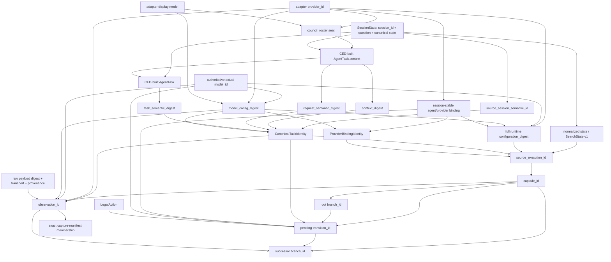

# SocratesZero Phase 8R — Failure-Precedence Decision Gate

## 1. Executive verdict

**Decision: A. NEW VERSIONED SUCCESSOR EXPERIMENT EARNED.**

The sealed Phase 8 hypothesis remains permanently `FALSIFIED`. The evidence
does not falsify the canonical successor seam: all five supported transitions,
strict semantic and SearchState parity, accepted move identity, isolation,
receipts, and resource accounting were supported. It falsifies the v1 negative
probe taxonomy because the pre-registered `wrong-provider` construction changed
a stronger CED-owned public-context invariant before the provider guard was
reached.

The governing model for the next experiment is exactly:

> **Model A — First Canonical Guard Wins.**

The current runtime already implements this model consistently. No runtime,
CED, context-digest, successor-environment, Value, Policy, SearchState,
Projection, Greedy, BestOfN, PUCT, Hybrid, depth, or authority semantic change
is required. The next work is a new evaluation lineage with explicit failure
precedence and probe orthogonality.

The exact next engineering branch is:

```text
feature/socrates-zero-canonical-successor-parity-v2
```

This branch name is intentionally about the new parity experiment. The runtime
environment remains `ced-canonical-successor-env/v0`; minting an environment
`v1` without changed environment semantics would be misleading.

Phase 8.5, shadow collection, depth two, Experience Store, learned Value,
learned Policy, RL, and production authority remain blocked.

## 2. Sealed Phase 8 result

The immutable starting point is:

| Item | Sealed value |
|---|---|
| Analysis base | `f1497faa762cd33e4cc939bd7bd18fa6d2ea974c` |
| Artifact commit | `07ec5ab14cd1599ffd6c8c4b6442d56d51129f11` |
| Artifact schema | `ced-canonical-successor-parity-artifact/v1` |
| Artifact ID | `cedparityartifactv1_893771ebb142e48b63dcdd623bdc734d7bb0da5697df251fadf73d3eda45f5e0` |
| Artifact SHA-256 | `00f9ba13bc2f52c970da9021c725b4941be1ff3a37705ce95f02d369671587ea` |
| Overall status | `FALSIFIED` |

The exact frozen metrics are:

```text
Supported cases:              5
Accepted parity:              1/1
Canonical rejection parity:   4/4
Unavailable negatives:       13/14

Semantic mismatches:           0
SearchState mismatches:        0
Accepted move-ID mismatches:   0

Source mutations:              0
Sibling mutations:             0
Production mutations:          0

Receipt mismatches:            0
Resource mismatches:           0
Live/provider/tool calls:       0
```

The only mismatch remains:

```text
probe:      wrong-provider
expected:   OBSERVATION_PROVIDER_MISMATCH
actual:     ROOT_CONTEXT_MISMATCH
successor:  none
dispatches: 0
mutation:   none
```

This document neither edits that expectation nor reclassifies the v1 result.
No v1 aggregate rerun or replay is authorized.

## 3. What was falsified

The falsified hypothesis was the complete versioned v1 hypothesis, including
the claim that every frozen negative probe would return its exact pre-registered
failure class. The `wrong-provider` probe replaced the provider catalog IDs with
`phase8-wrong-seat-*`. In CED, provider catalog IDs are also public council seat
labels. The mutation therefore changed `council_roster`, the canonical task
context, and the context/request digests. The earlier root-context guard won.

The scientifically correct statement is:

> Canonical accepted/rejected transition parity and isolation were supported on
> the frozen supported cases, but the v1 negative-probe taxonomy was falsified
> because the wrong-provider mutation also changed a stronger CED-owned
> root-context invariant.

The v1 taxonomy is not repaired post-result, the mismatch is not declared
harmless, and Phase 8 is not promoted.

## 4. What remained supported

The sealed evidence supports, but does not promote, the following bounded
technical claims:

- the one accepted reference reproduced the exact canonical successor;
- all four CED-owned canonical rejection references reproduced their exact
  rejection kinds;
- all frozen semantic parity fields, SearchState-v1 identities, and the accepted
  move ID matched;
- source, sibling, and production state remained unchanged;
- receipts, resource accounting, deterministic repeats, and processor identity
  matched;
- every negative failed closed with no successor, dispatch, or mutation;
- no live provider, model, or tool call occurred.

The precise status is:

```text
CORE TRANSITION PARITY SUPPORTED
EXPERIMENTAL TAXONOMY GATE FAILED
OVERALL VERSIONED HYPOTHESIS FALSIFIED
```

The four `APPLIED_CANONICAL_REJECTION` cases remain separate from successor
unavailability and require no semantic change.

## 5. Identity dependency graph

There is no single undifferentiated “root ID.” The implementation has layered
SearchState, normalized-state, runtime-configuration, source-execution, capsule,
and branch identities. The authoritative dependency graph is:



The exact node inventory follows. “Independent” means independently mutable as
an authoritative input before capture, not that its downstream derived IDs stay
unchanged.

| Node | Source of authority and inputs | Derived dependents | Validation layer/order | Caller-controlled? | Independently mutable? |
|---|---|---|---|---|---|
| Session identity | CED `create_session`; semantic ID hashes `session_id + question` | task, normalized root, source execution, capsule | registered-object capture guard, then rehydration | Initial ID/question only | Before capture only; a change creates a different root |
| `council_roster` | CED `_council_roster()` over healthy registry adapters: seat, display model, company | task context and its digests | canonical task replay; root-context compatibility | No replay control | Registry construction can change it |
| Provider identity | adapter `provider_id`; active route from CED `_session_adapter_bindings` | roster, binding, configuration, pending, observation | provider guard after root/task | Adapter/root input, not replay input | Catalog ID and active binding are distinct inputs |
| Actual model identity | registry calls adapter `authoritative_model_id()` fail-closed | binding, model config, full config, pending, observation | model guard after provider | Adapter/root input | Yes, if the public display roster is held fixed |
| Provider/model configuration | adapter catalog digest plus registry and CED settings | task model-config field, configuration, source execution | config guard after model | Named root settings only | Some fields, such as timeout, are independent of task context |
| Task-semantic identity | exact CED-built task: session, agent, role, phase, question, context, schema, round, kind, slot, attempt, plus model-config digest | source execution, capsule, pending, observation | replayed during capsule validation/application; task compatibility guard | No | No after CED task construction |
| Context digest | SHA-256 of complete CED-built `task.context` | task identity and root-context guard | first compatibility group | No | Only by changing CED-visible context input |
| Canonical root identity | SearchState ID + normalized semantics + configuration + task + bindings + ledgers/budget produce source execution, capsule, root branch | pending, observation provenance, receipt | capsule schema/self-hash, rehydration, semantic replay | No direct control | Composite/derived only |
| Observation identity | capture/root/task/provider/model/config/transport/raw digest/usage/provenance | exact manifest membership, receipt, successor lineage | contract integrity and manifest before compatibility | Caller may submit bytes, not authorize them | A changed object gets a new, unauthorized identity |
| Pending-transition identity | embedded capsule + action/legal set + task + expected provider/model + budget/processors | apply, receipt, result | contract self-validation then exact re-prepare | No | Derived/frozen only |
| Branch identity | environment + capsule + root/successor lineage tuple | receipts, result, ancestry | capsule/result contracts | No | Derived/frozen only |

The principal source locations are:

- roster/context/task construction: `backend/dialogues/ced.py:785-866` and
  `backend/dialogues/ced.py:1297-1323`;
- binding construction: `backend/dialogues/ced.py:1389-1428`;
- adapter/config capture: `backend/dialogues/ced_canonical_successor.py:157-173`
  and `backend/dialogues/ced_canonical_successor.py:226-363`;
- task identity: `backend/dialogues/ced_canonical_successor.py:856-898`;
- source execution/capsule/branch:
  `backend/dialogues/ced_canonical_successor_contracts.py:225-358`;
- pending identity:
  `backend/dialogues/ced_canonical_successor_contracts.py:448-577`;
- observation identity:
  `backend/dialogues/ced_canonical_successor_contracts.py:797-885`.

## 6. Council-roster/provider relationship

`council_roster` is not stored in `SessionState`. CED derives it at task-build
time from the available registry adapters. Each row contains:

```text
seat    = adapter.provider_id
model   = adapter.model if present, otherwise "mock"
company = model_company(model)
```

CED inserts this roster directly into every deliberation task context. At the
pristine opening, the relevant context is the roster, the empty
`dialogue_so_far`, and the CED-owned Socratic opening mandate. The roster is
therefore part of the public prompt semantics even though it is not a
`SessionState` field.

Provider identity is not derived from the roster. Both are sibling projections
of CED/registry state:

- the public roster uses the full available adapter catalog;
- the expected provider uses the active logical-agent binding in
  `_session_adapter_bindings`.

Consequences:

1. Replacing a provider catalog ID necessarily changes a roster seat and the
   task context.
2. Switching an active binding among providers already present in the roster
   can preserve the public context, but changes runtime configuration,
   provider-binding, source-execution, and capsule lineage.
3. The exact same frozen capsule/pending transition cannot legally admit another
   provider; `prepare_transition` derives one expected provider from its active
   binding, and `apply_observation` re-prepares the pending exactly.
4. Phase 8 v0 forbids `phase_retry`, so the existing retry/failover mechanism is
   outside this family.
5. Silent provider substitution would contradict public roster semantics,
   recorded provenance, and exact provider/model replay binding. It would not
   improve exact-model independence.

The focused environment test at
`tests_dialogues/test_ced_canonical_successor_env.py:586-593` reaches the
provider guard by directly replacing a private active binding while retaining
the catalog/roster. That proves contract-level reachability, not ordinary
canonical lifecycle reachability: no production CED method rebinds an existing
session in that way.

## 7. Validation check order

The runtime is already a deterministic first-failure pipeline. Every failure in
the table short-circuits all later rows unless the result column explicitly says
that CED continues to materialize a canonical rejection.

| Order | Stage/check | Owner | Inputs | Primary failure/result | Later checks? |
|---:|---|---|---|---|---|
| C1 | Source state is the exact registered CED session object | successor environment | `ced._sessions`, state object | `INVALID_ROOT` | No |
| C2 | Existing usage fits capture budget | budget contract | budget, usage | `BUDGET_EXHAUSTED` | No |
| C3 | Registry exists; retry and unsupported mutable facilities are disabled | successor environment | CED runtime config | `INVALID_ROOT` | No |
| C4 | Provider catalog is nonempty, offline/fake, unique, available, exact-model identified | registry/environment | adapters/catalog | `INVALID_ROOT` | No |
| C5 | Session adapter order and bindings cover canonical agents exactly | CED/environment | orders, bindings, agents | `INVALID_ROOT` | No |
| C6 | Snapshot/configuration/session rehydrate exactly | successor environment | snapshot, config digest, session ID | `INVALID_ROOT` | No |
| C7 | Pristine round-zero opening, pristine agents, empty ledgers/failures, one task | CED/environment | state, ledgers, registry | `INVALID_ROOT` | No |
| C8 | Canonical task/context/request/model-config identity derives successfully | CED/task contract | state, spec, binding | internal contract failure | No |
| C9 | Root projects to the sole hard-legal opening Socratic action | CED constitution | projected root | `INVALID_ROOT` | No |
| C10 | Newly captured capsule snapshot, bindings, budget, lineage, and IDs are self-consistent | capsule contract | full capsule | internal contract/validation error propagates; capture does not remap it | No |
| C11 | Capture left source CED unchanged | successor environment | before/after fingerprint | `INVALID_ROOT` | No |
| P1 | Capsule schema/identity round-trips | capsule contract | capsule | `INVALID_ROOT` | No |
| P2 | Root-only lineage, rehydration, pristine state, active binding | CED/environment | capsule/root | `INVALID_ROOT` | No |
| P3 | Rebuilt task equals frozen canonical task | CED/environment | root, task, binding config | `INVALID_ROOT` | No |
| P4 | Semantic root, SearchState-v1, and side-ledger identities replay | projection/environment | capsule/root | `INVALID_ROOT` | No |
| P5 | Supplied budget equals frozen root budget | successor environment | budgets | `INVALID_ROOT` | No |
| P6 | Action schema and identity round-trip | action contract | action | `ILLEGAL_ACTION` | No |
| P7 | Supported action-family guard | successor environment | action kind | `UNSUPPORTED_ACTION_FAMILY` | No |
| P8 | Complete hard-legal set and selected-action membership | CED constitution | root, action | `ILLEGAL_ACTION` | No |
| P9 | One successor reservation fits budget | budget contract | before + reserved usage | `BUDGET_EXHAUSTED` | No |
| P10 | Pending links root/action/task/provider/model/budget/legal set and derives IDs | pending contract | full pending | `INVALID_ROOT` | No |
| A1 | Pending has no stored extras and round-trips | pending contract/environment | pending | `INVALID_ROOT` | No |
| A2 | Pending re-prepares identically from its embedded root | successor environment + CED | capsule, action, budget | `INVALID_ROOT` or earlier prepare reason | No |
| A3 | Observation exists | successor environment | caller value | `MISSING_OBSERVATION` | No |
| A4 | Stored/mapping extras and future fields | successor environment | object structure | `FUTURE_LABEL_FORBIDDEN` or `INVALID_OBSERVATION_IDENTITY` | No |
| A5 | Observation schema, transport shape, raw digest, model-config relation, and ID | observation contract | observation fields/raw bytes | `INVALID_OBSERVATION` or `INVALID_OBSERVATION_IDENTITY` | No |
| A6 | Structured raw JSON has no future/control fields | successor environment | delivered raw JSON | `FUTURE_LABEL_FORBIDDEN` | No |
| A7 | Exact frozen manifest membership | capture-manifest authority | entire observation | `INVALID_OBSERVATION_IDENTITY` | No |
| A8 | Source-session, context, and request compatibility | compatibility contract | observed/pending task identity | `ROOT_CONTEXT_MISMATCH` | No |
| A9 | Phase/round/slot/attempt/agent/role/kind/task digest/action | compatibility contract | observed/pending task/action | `OBSERVATION_TASK_MISMATCH` | No |
| A10 | Provider binding | compatibility contract | observed/expected provider | `OBSERVATION_PROVIDER_MISMATCH` | No |
| A11 | Configured and actual model binding | compatibility contract | observed/expected models | `OBSERVATION_MODEL_MISMATCH` | No |
| A12 | Source and task/model configuration | compatibility contract | configuration digests | `OBSERVATION_CONFIG_MISMATCH` | No |
| A13 | Residual capsule and source-execution lineage | compatibility contract | capsule/execution IDs | `ROOT_CONTEXT_MISMATCH` | No |
| A14 | Special `REFUSED` transport projection | successor environment | transport status | `CANONICAL_PROCESSING_REJECTED` | No |
| A15 | Rehydrate, CED phase prelude, one spec, rebuilt task equality | successor environment + CED | pending root/task | `CANONICAL_PROCESSING_REJECTED` on exception | No |
| A16 | JSON parse/repair and move/schema/marker validation | canonical parser | raw text, task | parser/schema ProviderStatus | Continues only to form the canonical rejection |
| A17 | Socratic content contract, then injection firewall | CED | parsed move, state | content/injection canonical rejection | Accepted path stops on veto |
| A18 | Move/task-log/dispatch application or parser/schema/transport classification | CED | response, task, state | accepted or canonical rejection | To finalization |
| A19 | Phase finalization/quorum/registry-round append | CED | response, dispatch, state | exception becomes `CANONICAL_PROCESSING_REJECTED` | No on exception |
| A20 | CED outcome projection | successor environment | CED application record | `APPLIED_ACCEPTED` or `APPLIED_CANONICAL_REJECTION` | To successor construction |
| A21 | Successor configuration remains unchanged | successor environment | before/after config digest | `CANONICAL_PROCESSING_REJECTED` | No |
| A22 | Successor, receipt, and result identities/lineage | frozen contracts | applied state/outcome | contract rejection on internal inconsistency | Terminal |

The compatibility order is literal source order in
`validate_recorded_observation_compatibility()`:

```text
root context
→ task/action
→ provider
→ model
→ configuration
→ residual capsule/execution lineage
```

No later compatibility validator runs after the first mismatch.

## 8. Failure-layer taxonomy

The new taxonomy must preserve four disjoint layers.

### Preparation failures

These are raised before an observation result exists:

- `INVALID_ROOT`
- `ILLEGAL_ACTION`
- `UNSUPPORTED_ACTION_FAMILY`
- `BUDGET_EXHAUSTED`

### Observation-binding failures

These return `SUCCESSOR_UNAVAILABLE`, create no successor, and charge no
observation application:

- `MISSING_OBSERVATION`
- `INVALID_OBSERVATION`
- `INVALID_OBSERVATION_IDENTITY`
- `FUTURE_LABEL_FORBIDDEN`
- `ROOT_CONTEXT_MISMATCH`
- `OBSERVATION_TASK_MISMATCH`
- `OBSERVATION_PROVIDER_MISMATCH`
- `OBSERVATION_MODEL_MISMATCH`
- `OBSERVATION_CONFIG_MISMATCH`

`ROOT_CONTEXT_MISMATCH` is not a vague catch-all. It has two exact guard sites:

1. root semantic/request guard: `source_session_semantic_id`, `context_digest`,
   and `request_semantic_digest`;
2. residual lineage guard: `source_capsule_id` and `source_execution_id`.

The first site protects the exact session/question and public task request. The
second protects exact source provenance after all more specific binding guards
have passed. A future diagnostic record should expose the guard site, but the
governing enum need not change.

### Canonical-processing unavailability

`CANONICAL_PROCESSING_REJECTED` means the observation passed binding but could
not be projected through the supported processor path, including `REFUSED`, a
processor exception, or post-application configuration divergence. It is not a
canonical rejection.

### CED-owned applied outcomes

- `APPLIED_ACCEPTED`
- `APPLIED_CANONICAL_REJECTION`
  - `PARSER_REJECTED`
  - `SCHEMA_REJECTED`
  - `TRANSPORT_REJECTED`
  - `SOCRATIC_CONTENT_REJECTED`
  - `ANSWER_INJECTION_REJECTED`

These outcomes are owned by the existing CED parser, firewall, response
application, and finalization seam. They are not reinterpreted by the evaluator.

## 9. Failure-precedence models

| Model | Fit to repository | Decision |
|---|---|---|
| A — First Canonical Guard Wins | Matches every actual early return/raise; deterministic, fail-closed, and leaves CED authority intact | **Selected** |
| B — Most Specific Cause Wins | Would require continuing beyond failed integrity/security boundaries and inventing a second classifier | Rejected |
| C — Primary Failure + Diagnostic Causes | Safe only if A remains governing and diagnostics are precomputed comparisons; as a governing model it adds semantics not present in runtime | Rejected as the governing model |

Model B is particularly inappropriate for observation identity or manifest
failures: processing an unauthorized object further merely to obtain a more
specific label would weaken the authority boundary.

Model C is not selected. A new evaluator may carry non-authoritative component
evidence, but that evidence is not a secondary governing outcome and cannot
invoke later validators after failure.

## 10. Selected precedence model

The frozen rule for the next experiment is:

```text
PRIMARY FAILURE = FIRST FAILED CANONICAL GUARD IN ACTUAL SOURCE ORDER
```

Rules:

1. The primary result is exactly the first runtime return/raise.
2. A later failure class may be `DEFINED` yet unreachable for a given family and
   probe.
3. The evaluator never replaces the primary result with a “more specific” label.
4. Advisory mismatches may be derived only from already-authorized immutable
   components and may not cross a failed structural or manifest boundary.
5. Every probe has one frozen expected primary result. “Any fail-closed result”
   is not success.
6. No result may be reclassified after the first aggregate.

## 11. Orthogonal probe definition

An `ORTHOGONAL` probe changes exactly one independent authoritative input. Its
declared downstream identity changes may be numerous because IDs are derived,
but every guard earlier than the target guard must remain valid. The probe must
freeze:

- the one independent input mutation;
- the preserved earlier guard relations;
- every expected downstream derived change;
- the exact primary failure;
- a pre-result assertion that the intended target guard is reachable.

If the pre-result assertion shows an undeclared second independent mutation or
an earlier failed guard, the probe design is invalid and the aggregate must not
run.

## 12. Precedence probe definition

A `PRECEDENCE` probe intentionally combines independent incompatibilities or
uses one mutation whose dependency graph necessarily violates both an earlier
and a later relation. It tests the frozen check order, not an isolated failure
class.

For a precedence probe:

- every incompatibility is predeclared;
- the primary result is the earliest guard under Model A;
- later causes are `NOT_EVALUATED` by runtime;
- optional diagnostic comparisons are advisory only;
- exact failure, zero successor, zero dispatch/call, and zero mutation remain
  mandatory.

Orthogonal and precedence probes must use distinct schema fields and metrics.

## 13. `wrong-provider` forensic analysis

The sealed evaluator did the following:

```text
phase8-recorded-seat-*  →  phase8-wrong-seat-*
```

That produced this exact chain:

```text
provider catalog ID changes
→ council_roster[].seat changes
→ AgentTask.context changes
→ context_digest changes
→ request_semantic_digest changes
→ task_semantic_digest changes
→ canonical task/source execution/capsule/pending identities change
```

`validate_recorded_observation_compatibility()` checks the context and request
digests before task, provider, model, configuration, and lineage. The sealed
primary result was therefore correctly:

```text
ROOT_CONTEXT_MISMATCH
```

Three alternative constructions were audited:

1. Change only `observation.provider_id`: the observation identity changes and
   exact manifest authorization fails before provider compatibility.
2. Change only `pending.expected_provider_id`: pending contract identity or
   exact canonical re-prepare fails as `INVALID_ROOT`.
3. Build a normal root with a different provider catalog ID: roster/context
   changes and `ROOT_CONTEXT_MISMATCH` wins.

A fourth, restricted construction exists in a focused test: directly swap the
private active binding to another adapter already present in the unchanged
roster. It reaches `OBSERVATION_PROVIDER_MISMATCH`, but also changes runtime
configuration and source lineage, and no production CED operation creates that
rebinding. It is contract/private-binding reachability evidence, not an honest
ordinary-opening orthogonal aggregate probe.

The new classification is therefore:

```text
OBSERVATION_PROVIDER_MISMATCH
DEFINED
CONDITIONALLY REACHABLE AT THE CONTRACT/PRIVATE-BINDING TEST LAYER
NOT INDEPENDENTLY REACHABLE THROUGH THE ORDINARY V0 OPENING ROOT GENERATOR
```

The sealed catalog-ID construction becomes a new `PRECEDENCE` probe with primary
`ROOT_CONTEXT_MISMATCH`. It does not alter the v1 record.

## 14. Provider/model/config independent reachability

| Failure class | Verdict | Exact meaning and reachability |
|---|---|---|
| `OBSERVATION_PROVIDER_MISMATCH` | **CONDITIONAL** | Root-context and task are otherwise compatible, but the immutable observation provider differs from the pending active binding. Observation-only changes fail manifest; catalog changes fail context; a private binding-only test reaches the guard but is not ordinary lifecycle construction. Do not include it as an orthogonal aggregate probe. |
| `OBSERVATION_MODEL_MISMATCH` | **CONDITIONAL** | The frozen offline adapter exposes authoritative `model_id` but no public `.model`, so roster display remains `"mock"` and an exact-model-only root change reaches the model guard. If `.model` changes with the actual model, roster/context dominates. Model-config/config/lineage changes are declared downstream dependents. |
| `OBSERVATION_CONFIG_MISMATCH` | **YES** | A named runtime-only input such as `provider_timeout_seconds` changes full source configuration while preserving session, context, task-guard fields, provider, and exact model. The configuration guard precedes residual lineage. Freeze the exact field; generic “wrong config” is too broad. |

Provider mismatch must retain the narrow semantic definition:

> The root-context and task/action guards have passed, but the immutable
> recorded observation provider does not equal the canonical pending
> transition's active provider binding.

Its existence in code does not require an authoritative standalone probe when
the selected family cannot construct it honestly.

## 15. Context-digest audit

Verdict: **appropriate and intentionally strong; diagnostically broad, but not
architecturally over-broad on current evidence.**

The digest hashes the exact public context delivered to the canonical task. The
opening roster is intentionally visible deliberation context: it identifies who
is in the room. Removing provider seats or display models would make two
different public requests appear compatible and would weaken recorded replay
fidelity.

The digest is not an exact-model binding. In the frozen fixture, the public
display is `"mock"` while authoritative model identity is carried separately.
That is why model mismatch can be reached without a context mismatch in this
profile.

The digest can distinguish otherwise similar executions when an opaque provider
seat label or roster order changes. Because those bytes are actually delivered
to the task, that is not evidence that they are irrelevant. It is evidence that
`ROOT_CONTEXT_MISMATCH` alone is insufficiently decomposed for diagnostics.

No recommendation is made to remove roster/provider fields, weaken hashing, or
change CED task construction. Auditability should improve through component
digests, not looser binding.

## 16. Proposed composite digest diagnostics

Keep the current combined identities authoritative. Add an evaluator-side,
read-only diagnostic record in the next experiment containing precomputed
components such as:

```text
source_session_semantic_digest
root_state_digest
task_coordinates_digest
task_semantic_digest
public_context_digest
request_semantic_digest
public_roster_digest
provider_binding_digest
active_provider_binding_digest
actual_model_binding_digest
model_config_digest
runtime_configuration_digest
observation_payload_digest
observation_identity
combined_source_execution_id
```

The diagnostic contract must obey these rules:

- one combined compatibility identity remains governing;
- the primary failure remains the first runtime guard;
- component comparisons are advisory evidence, never a second taxonomy engine;
- no unauthorized observation is parsed or applied;
- no later validator is invoked after a failed guard;
- any emitted advisory mismatch set is itself pre-registered and compared
  exactly.

The next experiment can carry this in its v2 artifact without changing
`ced-canonical-transition-receipt/v0`. A runtime receipt `v1` is not required and
must not be minted merely for evaluator convenience.

## 17. New semantic versions required

### Immutable unchanged lineages

The following stay exactly unchanged:

- `ced-canonical-successor-env/v0`;
- `ced-canonical-branch-capsule/v0`;
- `ced-pending-canonical-transition/v0`;
- `ced-canonical-task-semantic-identity/v0`;
- `ced-recorded-observation/v1`;
- `ced-canonical-transition-result/v0`;
- `ced-canonical-transition-receipt/v0`;
- `ced-opening-socratic-question/v0`;
- `ced-canonical-successor-semantic-parity/v0` and its strict parity fields;
- `ced-canonical-successor-recording/v0`;
- capture manifest and its five exact observations;
- the sealed authoritative observation corpus v1 and five reference records;
- all CED processor IDs, accepted/rejection cases, budgets, zero-call rules, and
  isolation rules.

### New semantic lineages

The next implementation must predeclare:

- `ced-canonical-transition-failure-taxonomy/v1`;
- `ced-canonical-transition-failure-precedence/v1`;
- `ced-canonical-successor-probe-design/v1`;
- `ced-canonical-successor-compatibility-diagnostics/v1`;
- `ced-canonical-successor-unavailable-probe/v2`;
- `ced-canonical-successor-unavailable-case-result/v2`;
- `ced-canonical-successor-parity-case-set/v2`;
- `ced-canonical-successor-parity-corpus/v2`, as a composite experiment corpus
  that references rather than copies or re-records the immutable observation
  corpus v1;
- `ced-canonical-successor-parity-harness/v2`;
- `ced-canonical-successor-parity-metrics/v2`;
- `ced-canonical-successor-parity-thresholds/v2`;
- `ced-canonical-successor-parity-artifact/v2`;
- `ced-canonical-successor-parity-replay-lock/v2`.

The v2 artifact must carry the predecessor artifact ID and SHA-256, predecessor
status `FALSIFIED`, and change rationale
`failure-precedence-and-probe-orthogonality`. It must never reuse the v1
artifact identity.

## 18. New probe matrix

The invariant vector below freezes the compatibility relations for every probe:

```text
R = source execution/capsule lineage
T = task-guard fields (phase/round/slot/attempt/agent/role/kind/task digest)
C = root-context guard (session/context/request)
P = provider binding
M = configured/actual model binding
K = source and task/model configuration
O = exact raw observation bytes
D = observation digest/identity/manifest relation
A = action/family/hard-legal relation

= preserved   Δ changed   ∅ absent   — not constructed/evaluated
```

Downstream changes are allowed in an orthogonal probe only when they follow
deterministically from the one named independent input and are declared below.
All earlier guards must remain preserved.

### Orthogonal probes

| Probe ID | Class | One independent mutation | R/T/C/P/M/K/O/D/A | Declared dependent changes | Exact expected primary | Reachability / canonical layer | Frozen success condition |
|---|---|---|---|---|---|---|---|
| `p8v2-o01-invalid-root-registration` | ORTHOGONAL | Deep-copy the exact `SessionState`, changing only registered-object identity | `—/=/=/=/=/=/=/=/=` | No capsule constructed | `INVALID_ROOT` | Capture C1 | Exact reason; no capsule/call/mutation |
| `p8v2-o02-illegal-action-capability` | ORTHOGONAL | Add one unavailable required capability to the same-family action | `=/=/=/=/=/=/=/=/Δ` | action ID; no pending | `ILLEGAL_ACTION` | Constitution P8 | Exact reason; observation not evaluated |
| `p8v2-o03-missing-observation` | ORTHOGONAL | Pass `None` to the exact pending | `=/=/=/=/=/=/∅/∅/=` | none | `MISSING_OBSERVATION` | Observation A3 | Exact receipt; no usage/successor/call/mutation |
| `p8v2-o04-invalid-observation-schema` | ORTHOGONAL | Pass the frozen minimal malformed mapping | `=/=/=/=/=/=/Δ/—/=` | schema only | `INVALID_OBSERVATION` | Observation A5 | Exact reason; no manifest/compatibility processing |
| `p8v2-o05-tampered-raw-digest` | ORTHOGONAL | Corrupt stored raw digest while preserving exact raw bytes and frozen ID | `=/=/=/=/=/=/=/Δ/=` | observation integrity relation | `INVALID_OBSERVATION_IDENTITY` | Observation A5 | Exact reason before manifest/compatibility |
| `p8v2-o06-wrong-task-agent` | ORTHOGONAL | Rename only the active opening logical agent while preserving its provider seat | `Δ/Δ/=/=/=/Δ/=/=/=` | agent catalog/config and source lineage | `OBSERVATION_TASK_MISMATCH` | Compatibility A9 | Pre-result proof that C/P/M guards before target are preserved |
| `p8v2-o07-wrong-root-question` | ORTHOGONAL | Change only the root question while retaining session ID and provider/model/config profile | `Δ/Δ/Δ/=/=/=/=/=/=` | session/request/task and lineage IDs | `ROOT_CONTEXT_MISMATCH` | Compatibility A8 | Exact first guard and frozen mismatch-field set |
| `p8v2-o08-wrong-exact-model` | ORTHOGONAL | Change only active adapter authoritative `model_id`, retaining public display roster | `Δ/=/=/=/Δ/Δ/=/=/=` | full task ID through model-config, runtime config, lineage | `OBSERVATION_MODEL_MISMATCH` | Compatibility A11 | Allowed only after proof roster/context/task/provider stay fixed |
| `p8v2-o09-wrong-runtime-timeout` | ORTHOGONAL | Change only `provider_timeout_seconds` | `Δ/=/=/=/=/Δ/=/=/=` | configuration and residual lineage | `OBSERVATION_CONFIG_MISMATCH` | Compatibility A12 | Exact field frozen; all earlier binding guards pass |
| `p8v2-o10-future-label` | ORTHOGONAL | Add only forbidden observation field `reward` | `=/=/=/=/=/=/=/=/=` plus future field `Δ` | envelope becomes forbidden | `FUTURE_LABEL_FORBIDDEN` | Observation A4 | Exact reason before schema/manifest/compatibility |
| `p8v2-o11-budget-exhausted` | ORTHOGONAL | Reduce only transition capacity below one reservation | `Δ/=/=/=/=/=/=/=/=` | budget-root identity; no pending | `BUDGET_EXHAUSTED` | Prepare P9 | Exact reason; no observation processing |

Every orthogonal row additionally requires deterministic repeat equality, no
successor, zero aggregate provider/live/tool calls, unchanged source and
production state, and exact resource accounting.

### Precedence probes

| Probe ID | Class | Intentional overlap | R/T/C/P/M/K/O/D/A | Exact expected primary | Optional advisory mismatches | Why reachable / reference layer | Frozen success condition |
|---|---|---|---|---|---|---|---|---|
| `p8v2-p01-unsupported-family-vs-legality` | PRECEDENCE | Change action kind to `RUN_ELENCHUS`; it is also absent from the hard-legal set | `=/=/=/=/=/=/=/=/Δ` | `UNSUPPORTED_ACTION_FAMILY` | `not_in_legal_set` | P7 precedes P8 | Exact family result; Constitution not evaluated |
| `p8v2-p02-provider-roster-context` | PRECEDENCE | Replace provider catalog seat IDs; roster/context/task/config/lineage follow | `Δ/Δ/Δ/Δ/=/Δ/=/=/=` | `ROOT_CONTEXT_MISMATCH` | task, provider, config, lineage | A8 precedes A9/A10/A12/A13; canonical replacement for sealed construction | Exact root-context result; never provider-specific |
| `p8v2-p03-root-plus-provider` | PRECEDENCE | Change question and provider catalog together | `Δ/Δ/Δ/Δ/=/Δ/=/=/=` | `ROOT_CONTEXT_MISMATCH` | provider, config, lineage | A8 precedes A10 | Exact root result and declared advisory vector |
| `p8v2-p04-task-plus-model` | PRECEDENCE | Rename active agent and change its exact model with display roster fixed | `Δ/Δ/=/=/Δ/Δ/=/=/=` | `OBSERVATION_TASK_MISMATCH` | model, config, lineage | A9 precedes A11/A12/A13 | Exact task result; model guard not invoked |
| `p8v2-p05-context-plus-tampered-digest` | PRECEDENCE | Different-question root plus corrupt observation digest | `Δ/Δ/Δ/=/=/=/=/Δ/=` | `INVALID_OBSERVATION_IDENTITY` | root mismatch advisory only | A5 precedes manifest and A8 | Exact integrity result; no compatibility validator invoked |
| `p8v2-p06-illegal-plus-incompatible-observation` | PRECEDENCE | Same-family illegal action plus an observation from another root | `Δ/Δ/Δ/=/=/=/=/=/Δ` relative to observation | `ILLEGAL_ACTION` | observation `NOT_EVALUATED` | P8 prevents pending/apply | Exact action result; zero observation application |
| `p8v2-p07-caller-rebinding-vs-manifest` | PRECEDENCE | Re-mint raw bytes against another root/task/provider/model/config | `Δ/Δ/Δ/Δ/Δ/Δ/=/Δ/=` | `INVALID_OBSERVATION_IDENTITY` | full binding difference vector | A7 precedes compatibility | Exact manifest result; raw bytes never parsed/applied |

The private-binding construction that reaches
`OBSERVATION_PROVIDER_MISMATCH` remains a focused contract test only. It is not
an authoritative orthogonal aggregate probe unless a future, public,
canonically producible binding-only root operation is separately specified and
versioned.

Candidate v2 counts are therefore:

```text
Supported authoritative cases: 5
Accepted references:            1
Canonical rejections:           4
Orthogonal negatives:          11
Precedence negatives:           7
Total cases:                   23
```

## 19. Frozen success and falsification criteria

### Primary hypothesis

> Under a predeclared first-canonical-guard-wins precedence contract and a probe
> suite that separates one-input orthogonal mutations from intentional
> dependency/precedence mutations, the unchanged CED-owned successor seam will
> preserve 100% canonical transition parity and return the exact frozen primary
> fail-closed classification for every v2 negative probe.

### Success criteria

All of the following are required:

- accepted parity `1/1`;
- canonical rejection parity `4/4` with unchanged rejection kinds;
- exact equality for every strict parity field, SearchState-v1 ID, and accepted
  move ID;
- orthogonal primary classifications `11/11`;
- precedence primary classifications `7/7`;
- all declared earlier-guard preservation assertions pass;
- evaluation failures `0`;
- unavailable successors `0` for all negatives;
- source, sibling, and production mutations `0`;
- aggregate provider dispatches, live calls, and tool calls `0`;
- receipt, resource, processor, idempotence, and isolation mismatches `0`;
- any emitted advisory diagnostic vector equals its frozen expected vector;
- independent replay has semantic equality, artifact-ID equality, canonical byte
  identity, and the recorded SHA-256.

### Falsification criteria

The v2 hypothesis is falsified by any one of:

- any positive semantic, SearchState, move-ID, rejection-kind, receipt, resource,
  processor, or isolation mismatch;
- any orthogonal or precedence primary-code mismatch;
- a supposedly orthogonal probe changing a second undeclared independent input;
- a declared earlier invariant failing before the target guard;
- representing the private provider-binding test as ordinary-lifecycle
  reachability;
- any incompatible observation producing a successor;
- any source, sibling, or production mutation;
- any aggregate provider dispatch, live call, or tool call;
- any evaluator exception or missing scientific result;
- any diagnostic cause overriding or reinterpreting the primary runtime result;
- any post-result expectation change;
- any replay semantic, artifact identity, or byte divergence.

There is no “close enough,” aggregate retry, or post-hoc reclassification.

## 20. Exact next engineering milestone

Create exactly one implementation branch:

```text
feature/socrates-zero-canonical-successor-parity-v2
```

The branch must not change environment runtime semantics. Its work is:

1. Freeze this dependency graph, source check order, Model A precedence, and
   reachability classifications in versioned contracts.
2. Implement explicit `ORTHOGONAL`/`PRECEDENCE` probe schemas and invariant
   vectors.
3. Add pre-result focused tests proving each earlier guard is preserved and each
   declared downstream dependency is correct.
4. Keep the five observation/capture/reference records byte-identical; create a
   v2 composite experiment corpus that references their immutable v1 IDs.
5. Freeze the 18 probe definitions, case set, metrics, thresholds, harness,
   artifact, diagnostic, and replay-lock schemas before any result.
6. Include predecessor artifact identity, SHA, `FALSIFIED` status, and reason in
   v2 lineage.
7. Run all pre-result gates, static second-CED review, zero-call checks, frozen
   artifact integrity, and `git diff --check`; stop on any failure.
8. Commit and report the complete pre-result freeze.
9. Only then run the first and only authoritative v2 aggregate, publish one new
   write-once artifact, commit it, and run independent reverse-order replay.
10. Require semantic equality, artifact-ID equality, canonical byte identity,
    and SHA-256 before a durable success checkpoint.

No provider call or observation re-recording is needed. A fully passed v2 would
earn Phase 8.5 as the **next decision gate only**. It would not itself authorize
real shadow collection, depth two, Experience Store, learned Value, learned
Policy, RL, or production authority.

## Decision-gate verification

Phase 8R ran only existing tests and read-only integrity checks:

| Gate | Exact result |
|---|---|
| Phase 8 recording/corpus/contracts/environment/evaluator pre-result suite | `75 passed in 4.38s` |
| Focused Phase 8 successor environment | `42 passed in 2.95s` |
| Sealed Phase 8 artifact integrity | working blob equals artifact-commit blob; ID/status/13-of-14 metrics exact; SHA-256 `00f9ba13bc2f52c970da9021c725b4941be1ff3a37705ce95f02d369671587ea` |
| Frozen Phase 5/7 artifact integrity | `10 passed in 4.16s`; all three SHA-256 values exact |
| Focused CED production parity | `241 passed in 12.49s` |
| Pre-commit documentation scope | exactly five new Markdown files; `git diff --cached --check` passed |
| Aggregate/artifact builder/replay publication calls | `0` |
| Live/provider/model/tool calls | `0` |

The exact test file sets are recorded in the branch `PRESENT.md`. The sealed
aggregate and all artifact builders remained unexecuted.

The protected untracked files `scripts/live_dialogue.py.bak` and the malformed
root filename beginning `ocratic_followup_mandate` remain outside the branch
diff and must never be staged.
